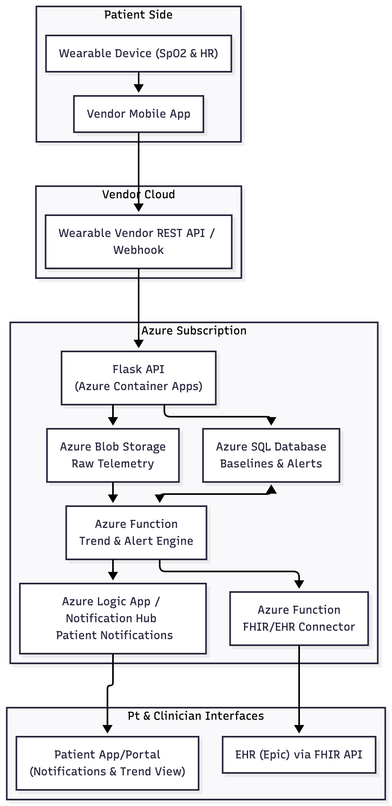

# Architecture & Implementation Plan



**Important:**

**The FHIR/EHR integration layer is included in the architectural level to demonstrate how alerts would be surfaced in a healthcare workflow. This component is not implemented in the prototype due to lack of EHR credentials and constraints.**


## Service Mapping
| Layer | Service (Cloud) | Role in Solution | Related Module|
| :------- | :-------: | :--------: | --------:|
| Application/ API | Flask app (Azure Container Apps) | Exposes ingest endpoint for wearable/vendor data | Assignment 2 (Flask) & Module 10 Containers |
|Storage for raw telemetry | Azure Blob Storage | Stores raw SpO2/HR JSON data from the Flask API in a time-partitioned layout | Module 6 (Storage) |
|SQL Database | Azure SQL Database | holds patient baselines, configurations, and structured alert records. | Module 7 (Managed DBs) and Assignment 4 |
| Background compute | Azure Function - TrendFn | Periodically reads recent telemetry, compares to baselines, and triggers alerts | Module 5 (Serverless Functions) and HHA 507 Group Assignment Part 4 Flagging |
|Notifications | Azure Logic App/ Notification Hubs | Sends alerts to patients via App/ SMS/ email | (None) |
| EHR integration | Azure Function - FHIRFn | Converts alerts into FHIR resources and sends them to Epic's FHIR API | (None) |
| ML analytics | Azure ML/ Notebooks | Used offline to analyze historical COPD data and refine thresholds | Module 9 (AI) |

## Data Flow Narrative

* Step 1: Wearable data captured on patient side: 

    Wearable data(SpO2 and HR) is captured and syncs these readings to the Vendor Mobile App on the patient's phone, which then forwards data to the vendor's cloud through the VendorAPI.

* Step 2: Flask API ingestion in Azure: 

    The vendor's system sends the wearable data to a Flask API running in Azure Containers Apps. This Flask application exposes an HTTP endpoint called /ingest and sends over JSON data in the following format:

        ```json
        {
            "patient_mrn" : :"12345678"
            "timestamp" : "2025-12-03T13:40:03Z",
            "spo2": 89,
            "heart_rate": 122
        }
        ```
* Step 3: Storing Raw Telemetry:

    After receiving the data, the Flask application validates and normalizes the payload. The data is then written to Azure Blob Storage as raw telemetry. 
    Files will be organized by patient and date.

* Step 4: Maintaining Baselines and Configuration:

    Personalized patient thresholds and ranges are stored in Azure SQL Database. This includes their typical SpO2 ranges, resting heart rate, and alert thresholds.

* Step 5: Trend Detection and Alert Logic:

    A scheduled Azure Function runs periodically every 30 minutes.
        Each time it runs, the function:
        1. Reads recent telemetry data from Azure Blob Storage
        2. Retrieves the patient's baseline values and alert thresholds from Azure SQL
        3. Calculates rolling averages and trend changes
        4. Checks for signs of deterioration such as:

                - SpO2 dropping below baseline
                - Persistently low SpO2 values
                - Sustained elevated heart rate
    If there are no concerns, the function records a normal status and exits. If deteriorating trends are detected, the function writes an alert record into Azure SQL Database and logs the event for future analysis.

* Step 6: Patient Notifications: 
    When early deterioration is detected, Azure Notification Hub sends a simple notification to the patient via a mobile app, SMS, or email as a warning for self-management or follow-up if symptoms worsen. These messages are non-diagnostic and designed to increase patient awareness.

* Step 7: Clinician EHR Integration: 
    For high-severity alerts, a separate Azure Function (FHIRFn) is used to integrate with the EHR. FHIRFn will read alert data and recent trends from Azure SQL, convert information into FHIR Communication resources and send the data over to an EHR via FHIR API. 

* Step 8: Analytics Improvement:
    Use Azure ML notebooks to analyze Azure Blob Storage and evaluate which thresholds and pattern most accurately predicts COPD exacerbations and refine alert logic for the future.


## Security, Identity, and Governance Basics
In this architectural design, I would avoid hard-coding any secrets directly into the Flask code or Azure Functions. Secrets should be stored in Azure Key Vault and injected at runtime via managed identities or environment variables. That way, the Flask Container App and Azure Functions can securely pull what they need without exposing secrets in GitHub. All external traffic would be over HTTPS as well.

Access to data in Azure Blob Storage and Azure SQL Databases would be controlled using Azure Role-Based Access Control. Only special permission would be given to identities for the Flask App, TrendFn, Logic Apps, and FHIRFn to read/write production data. For this assignment, I am only using synthetic data not real PHI. In a real deployment, there would be private endpoints deployed, encryption at rest, and audit log. 

## Cost and Operational Considerations
The main potential cost drivers in this architecture are computing such as Flask running in Azure Container Apps, Azure Functions, and Logic Apps, and the managed database(Azure SQL). Blob Storage is very cheap for JSON data. To keep compute costs low, I rely heavily on serverless and event-driven components. Azure Functions and Logic Apps are scaled down to zero when not in use. The Flask container can also be given minimal CPU/ memory for this prototype. The function will also run every 30 minutes to keep computing cost lower. 

To keep this project student budget friendly, I would:

    1. Limit the number of simulated patients and increase the ingestion frequency to 30 minutes rather than every few seconds. 
    2. start Azure SQL on a small/basic tier
    3. avoid running any always-on VMs. If I needed heavier analytics later on, I would run them as scheduled jobs to avoid paying for long-running servers. 