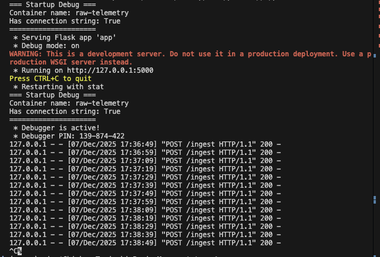
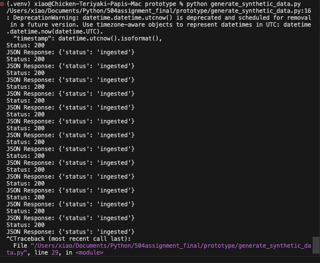
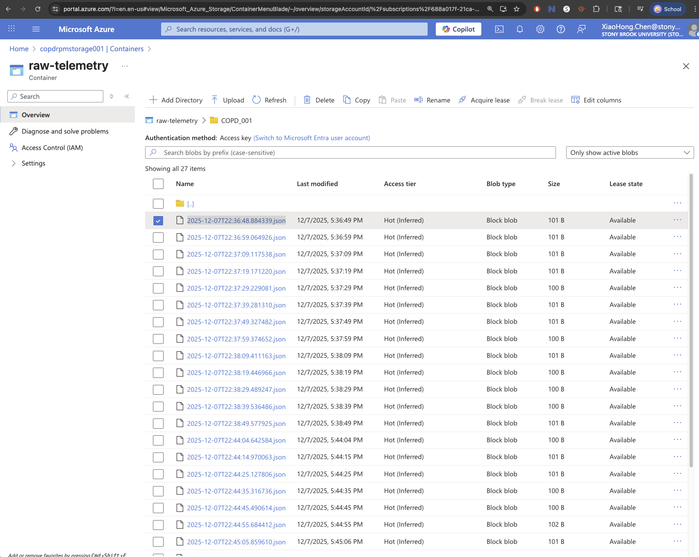

# COPD Wearable Ingestion Prototype (Flask + Azure)

This prototype demonstrates the ingestion portion of a cloud-based COPD remote
patient monitoring system.

It simulates a wearable **vendor API** pushing SpO2 and heart-rate data to a
**provider-owned Flask ingestion service**, which persists raw telemetry to
**Azure Blob Storage**. All data used is synthetic.

---

## 0. System Setup on macOS (One-Time)

These steps are for setting up the Mac environment (only needed once per machine).

### 0.1 Install Homebrew (if not already installed)

Open Terminal and run:

```bash
/bin/bash -c "$(curl -fsSL https://raw.githubusercontent.com/Homebrew/install/HEAD/install.sh)"
```

### 0.2 Add Homebrew to shell environment:
```bash
echo >> /Users/xiao/.zprofile
echo 'eval "$(/opt/homebrew/bin/brew shellenv)"' >> /Users/xiao/.zprofile
eval "$(/opt/homebrew/bin/brew shellenv)"
```

Close and reopen terminal.


### 0.3 Install Azure CLI via Homebrew
```bash
brew update && brew install azure-cli
az --version    # verify install
```

## 1. Project Structure
```text
504assignment_final/
└── prototype/
    ├── app.py
    ├── generate_synthetic_data.py
    ├── requirements.txt
    └── (created locally)
        └── .env
        └── venv/ or .venv/
```


## 2. Python Environment & Dependencies

### 2.1 Create and activate a virtual environment
```bash
python -m venv .venv
source .venv/bin/activate
```

### 2.2 Install Python requirements
in the terminal, run 
```
cd 504assignment_final/prototype
pip install -r requirements.txt
```

requirements should include:
```
flask
python-dotenv
azure-storage-blob
requests
```

## 3. Azure Resources 
Create the following in Azure Portal:

    - Resource group: copd-rpm-rg
    - Storage Account: copdrpmstorage001
    - Blob Container: raw-telemetry (private)
    - App Service: copd-rpm-api
        - Publish: Code
        - Runtime: Python 3.14, Linux
        - Region: same as storage account

## 3.1 Obtain Storage Connection String
Obtain connection string from:

    Azure Portal -> Storage accounts -> copdrpmstorage001 -> Security -> Access keys
    
    Copy connection string

## 4. Environment Configuration
### 4.1 Create local .env file
```env
AZURE_STORAGE_CONNECTION_STRING=DefaultEndpointsProtocol=https;AccountName=copdrpmstorage001;AccountKey=YOUR_KEY_HERE;EndpointSuffix=core.windows.net
BLOB_CONTAINER_NAME=raw-telemetry
```

### 4.2 App Service Configuration
Azure Portal -> App Service -> copd-rpm-api -> environment variables -> App settings:

Add:
    - AZURE_STORAGE_CONNECTION_STRING = same string as in .env
    - BLOB_CONTAINER_NAME = raw-telemetry

Save and restart App

## 5. Run Locally
### 5.1 Start the Flask API
```
python app.py 
```

You should see:
```
=== Startup Debug ===
Container name: raw-telemetry
Has connection string: True
=====================
 * Running on http://127.0.0.1:5000
```




### 5.2 Run syntehtic wearable data
On a second terminal, run:
```
python generate_synthetic_data.py
```

You should see:
```
Status: 200
JSON: {'status': 'indigested', 'blob_name': 'COPD_001/2025-12-07T...json'}
```



### Verify in Azure Blob Storage
Azure Portal -> Storage Accounts -> copdrpmstorage001 -> containers -> raw-telemetry

You should see:

COPD_001/2025-12-07T22:36:48.884339.json



## 6. Deploy to Azure App Service

After locally testing works:
    1. Install Azure App Service extension on VS Code
    2. In VS Code, sign into Azure
    3. Right click prototype/ folder and deploy to web app
    4. Select subscription to copd-rpm-api
    5. Confirm deployment

## 7. Run Against the Cloud Endpoint
Edit generate_synthetic_data.py and set:
```
BASEURL = "https://copd-rpm-api.azurewebsites.net/ingest"
```

then run:
```
python generate_synthetic_data.py
```

You should see blobs appearing in raw-telemetry again.


## Breakdown 
- generate_synthetic_data.py
    - simulates a wearable vendor cloud API pushing JSON telemetry.
- app.py
    - A Flask ingestion API owned by the health system, which:
        - Accepts vendor POSTs at /ingest
        - Validates the payload
        - Writes raw telemetry as JSON files into Azure Blob Storage.

